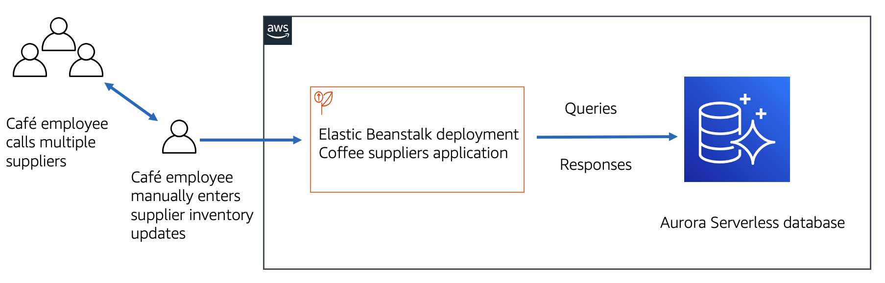
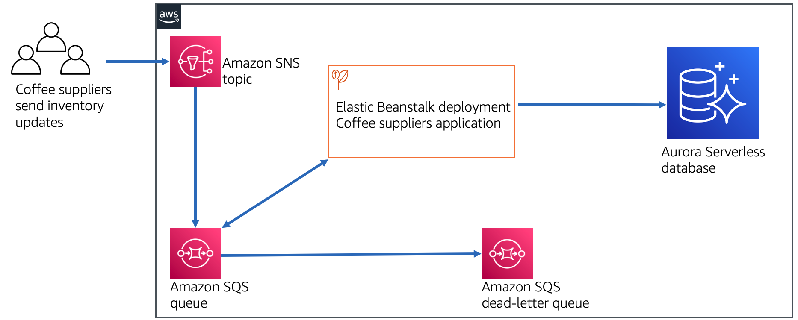

# aws-dev-messaging_using_SNS_and_SQS
Implementing a Messaging System Using Amazon SNS and Amazon SQS

## Lab Objectives:

* Configure SNS topics and SQS queues to support programmatic receipt of messages
* Develop an Amazon SNS publisher to send messages to an SNS topic
* Develop an Amazon SQS consumer to read messages from an SQS queue

## start lab

## completed lab

